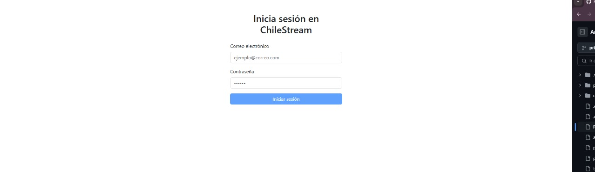

# ChileStream – Centro de Entretenimiento
## 🎯 Objetivo

Migrar e implementar el proyecto a **Angular versión 18** usando **TypeScript**, mejorando la seguridad del login, la performance, y finalizando las funcionalidades principales del menú.

Autor: Iván Panduro
## Capturas de Pantalla

  #Login
  

  #Pantalla Principal 
 
  

#Descripción del desarrollo
  -Se migró el proyecto a Angular 18.
  -Se implementó login con validación de formularios reactivos.
  -Se creó una vista principal (Home) con tarjetas dinámicas de películas.
  -Las imágenes se organizan en la carpeta /assets/peliculas.

#Problemas conocidos 
  --Algunas validaciones no muestran mensajes dinámicos.
  --Aún no se incluye funcionalidad de búsqueda ni filtros por estado de ánimo.

#Retrospectiva
  -¿Qué hice bien?: Migración exitosa, estructura clara y organización de componentes.
  -¿Qué no salió bien?: Conflictos al subir a GitHub y detalles con imágenes locales.
  -¿Qué puedo hacer diferente?: Automatizar pruebas, usar servicios con API para las películas.
